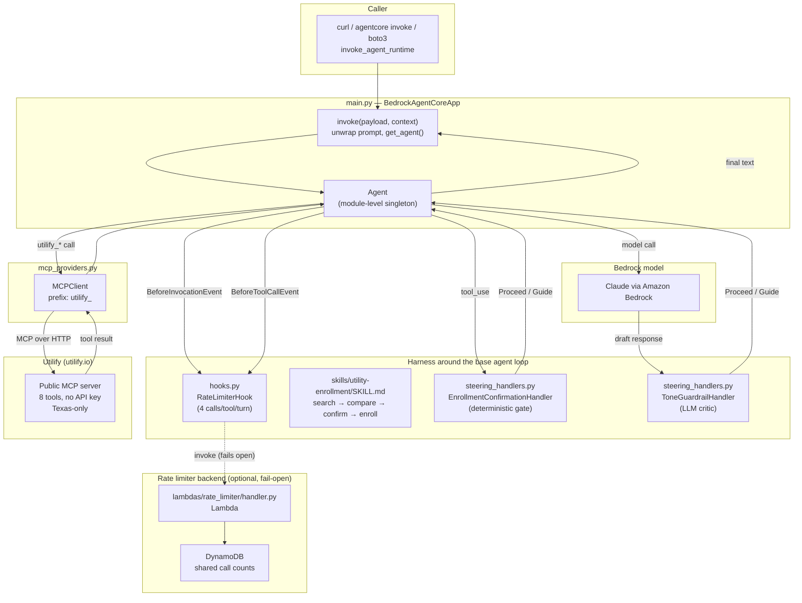

# Architecture

How Movers Helper Agent is put together: the agent loop, the harness wrapped around
it, and how that all gets deployed. See [README.md](README.md) for what it
does and how to run it, and [DEPLOY.md](DEPLOY.md) for deploy specifics.

## Overview

Movers Helper Agent is a single [Strands Agents](https://strandsagents.com/) agent
with one tool source (a remote MCP server) and a harness of hooks, skills,
and steering guardrails wrapped around the base agent loop. There's no
orchestration layer, vector store, or custom scaffolding beyond what Strands
provides - the interesting design decisions are in the guardrails, not in
plumbing.

## Components

| File | Role |
| --- | --- |
| [main.py](main.py) | Entrypoint. Wraps the agent in `BedrockAgentCoreApp`, builds the module-level `Agent` singleton, holds the system prompt, unwraps the request payload. Same code path locally (`python main.py`) and deployed. |
| [mcp_providers.py](mcp_providers.py) | The agent's only tool source: one `MCPClient` pointed at Utilify's public MCP server, prefixed `utilify_` so every tool call, log line, and guardrail rule can name its origin unambiguously. |
| [hooks.py](hooks.py) | `RateLimiterHook` - a Strands `HookProvider` that caps each tool at 4 calls per turn, either in-process or (see below) via a shared Lambda-backed counter. |
| [lambdas/rate_limiter/handler.py](lambdas/rate_limiter/handler.py) | Standalone Lambda function `RateLimiterHook` calls when running in cross-container mode: atomically increments a (turn, tool) counter in DynamoDB and reports whether it's over the caller's limit. |
| [steering_handlers.py](steering_handlers.py) | Two independent guardrails (below): `EnrollmentConfirmationHandler` (deterministic) and `ToneGuardrailHandler` (LLM-based). |
| [skills/utility-enrollment/SKILL.md](skills/utility-enrollment/SKILL.md) | The workflow the model activates mid-conversation: get a Texas address → search → narrow down → confirm → enroll → hand off the link. Loaded via `AgentSkills(skills=["./skills"])`. |
| [deploy.sh](deploy.sh) / [DEPLOY.md](DEPLOY.md) | Scaffolds and deploys `main.py` onto Amazon Bedrock AgentCore Runtime via the `agentcore` CLI and CDK; also runs `scripts/deploy_rate_limiter.py`. |
| [scripts/invoke_runtime.py](scripts/invoke_runtime.py) | Standalone client for calling a deployed runtime directly via `boto3`, outside `agentcore invoke`. |
| [scripts/deploy_rate_limiter.py](scripts/deploy_rate_limiter.py) | Provisions/tears down the rate limiter's Lambda + DynamoDB table directly via `boto3`, outside the agentcore-managed CDK app. |
| [tests/](tests/) | Offline unit tests (rate limiter - both local and Lambda-backed modes, the Lambda handler itself, payload parsing) plus an opt-in live suite against a real model/runtime. |
| [Makefile](Makefile) | Thin wrapper over the above (`make run`, `make test`, `make deploy`, ...). |

## The agent loop

`main.py`'s `invoke()` is called once per request (by AgentCore Runtime, or
by the local dev server it runs when `python main.py` is run directly). It
unwraps the prompt from the payload, then calls the module-level `Agent`
singleton - `agent(prompt)` - which runs Strands' internal loop:

1. **`BeforeInvocationEvent` fires.** `RateLimiterHook.reset()` zeroes its
   per-tool call counts and mints a fresh `invocation_id` - the limit is per
   turn, not global to the process.
2. The user message is appended to `agent.messages`, then trimmed to the
   last 20 messages by `SlidingWindowConversationManager(window_size=20)`.
3. The model is called with the system prompt, message history, and the
   `utilify_*` tool schemas.
4. **`steer_after_model` fires.** `ToneGuardrailHandler` reviews the draft
   response against its own system prompt (no invented prices, no false
   "you're enrolled" claims, etc.) and can `Guide` the agent to revise
   before anything reaches the customer.
5. For each tool call the model wants to make:
   - **`BeforeToolCallEvent` fires** → `RateLimiterHook.check()` increments
     that tool's count - via the rate-limiter Lambda if `main.py` configured
     one (falling back to a local, in-process count if that call fails) or
     purely in-process otherwise - and cancels the call once it exceeds 4
     for this turn.
   - **`steer_before_tool` fires** → `EnrollmentConfirmationHandler` only
     acts on `utilify_initiate_signup` / `utilify_request_solar`; everything
     else is waved through.
   - If not blocked, the call runs through `MCPClient` to Utilify's remote
     MCP server, and the result is appended to `agent.messages`.
6. Repeat from step 3 until the model responds with no further tool calls.
7. `invoke()` stringifies and returns that final response.

**Session state**: AgentCore Runtime pins a session's requests to the same
warm container, so `agent.messages` on the singleton already carries context
across turns for that session - there's no `FileSessionManager` or external
session store.

## Guardrails

Two independent mechanisms, catching two different failure modes:

| | Mechanism | Catches | Where |
| --- | --- | --- | --- |
| **Rate limiter** | Deterministic, in a hook (optionally backed by a shared Lambda+DynamoDB counter - fails open if that's unreachable) | A confused model looping on the same tool | `RateLimiterHook` |
| **Enrollment gate** | Deterministic, in steering | Enrollment/solar-inquiry running without the customer's *current*, explicit go-ahead | `EnrollmentConfirmationHandler` |
| **Tone guardrail** | LLM-based, in steering | Invented providers/prices, overpromised savings, false "enrollment complete" claims, leaked internals | `ToneGuardrailHandler` |

`EnrollmentConfirmationHandler` specifically checks the **most recent** user
message for a confirmation phrase (`"yes"`, `"go ahead"`, `"sign me up"`,
...) before letting `utilify_initiate_signup` or `utilify_request_solar`
run - an earlier "I'm interested" doesn't count as standing consent. Even
once it proceeds, `utilify_initiate_signup` only returns a redirect link;
the customer still finishes enrollment on the provider's own site, so a
human stays in the loop for the actual signup too, not just the decision to
start it.

## Deployment

`main.py` is the deployable unit - no separate build artifact. `deploy.sh`:

1. Scaffolds `agentcore-project/MoversHelperAgent/` via `agentcore create` (a CDK
   app the `agentcore` CLI manages - gitignored, regenerated on demand).
2. Copies `main.py`, `mcp_providers.py`, `steering_handlers.py`, `hooks.py`,
   and `skills/` into that scaffold.
3. Runs `uv init`/`uv add` there to produce the `pyproject.toml` the
   CodeZip build needs.
4. Registers it as a "Bring your own code" Strands agent (`agentcore add
   agent`) and deploys via `agentcore deploy -y`.
5. Runs `scripts/deploy_rate_limiter.py` to provision the rate limiter's
   Lambda + DynamoDB table and grant the runtime's execution role permission
   to invoke it - see that script's docstring for why this is a plain
   `boto3` script rather than added to the CDK app from step 1.

That provisions, via CloudFormation:

| Resource | Purpose |
| --- | --- |
| `AWS::IAM::Role` (+ policy) | Execution role scoped to Bedrock model invocation, CloudWatch Logs, X-Ray, AgentCore config bundles |
| `AWS::BedrockAgentCore::Runtime` | The hosted runtime itself |

...plus, via `scripts/deploy_rate_limiter.py` (outside CloudFormation):

| Resource | Purpose |
| --- | --- |
| `AWS::DynamoDB::Table` | Shared call-count storage, PAY_PER_REQUEST, rows TTL-expired |
| `AWS::Lambda::Function` | `lambdas/rate_limiter/handler.py` |
| `AWS::IAM::Role` | Execution role for that Lambda (`dynamodb:UpdateItem` on just that table) |
| Inline policy on the runtime's execution role | `lambda:InvokeFunction` on that function |

No container image and no new S3 bucket - code ships as a zip to the CDK
bootstrap staging bucket already in the account. See [DEPLOY.md](DEPLOY.md)
for prerequisites, cost caveats, and teardown.

## Testing

- **Offline unit tests** (`tests/test_hooks.py`, `tests/test_rate_limiter_lambda.py`,
  `tests/test_deploy_rate_limiter.py`, `tests/test_main_entrypoint.py`):
  exercise `RateLimiterHook` (both local and Lambda-backed modes, via an
  injected fake Lambda client), the Lambda handler itself (via an injected
  fake DynamoDB table), and `invoke()`'s payload parsing - all with stubbed
  dependencies, no AWS credentials or model calls.
- **Live smoke tests** (`tests/test_live_agent.py`): opt-in
  (`RUN_LIVE_TESTS=1`), call a real model - either in-process (same path as
  `main.py`) or, with `AGENT_RUNTIME_ARN` set, the deployed runtime via
  `boto3`. These assert the enrollment guardrail actually holds against a
  live model, not just that the code is wired up.

## Design decisions worth knowing

- **One tool source, on purpose.** An earlier version paired Utilify with a
  parallel mock multi-city toolset; it was cut so every answer comes from
  one source of truth, even at the cost of Texas-only coverage.
- **Confirmation is scoped to the *current* message.** The gate checks only
  the most recent user message, not the whole conversation, so an earlier
  expression of interest can't be replayed as consent later.
- **Two guardrails instead of one.** A deterministic gate and an LLM critic
  fail differently - the gate can't be talked out of blocking a tool call,
  the critic can catch tone/content problems no keyword rule would.
- **No session store beyond AgentCore's own.** Relying on the runtime's
  warm-container pinning (rather than a `FileSessionManager`) keeps the
  agent's state model identical locally and in production.
- **The rate limiter fails open.** If its Lambda errors, times out, or isn't
  deployed, `RateLimiterHook` falls back to a fresh local count rather than
  blocking tool calls - a stricter fail-closed policy would turn an infra
  hiccup (or just not having deployed the Lambda yet) into blocked
  customers, for a guardrail whose job is catching a confused model, not
  enforcing a hard security boundary.
